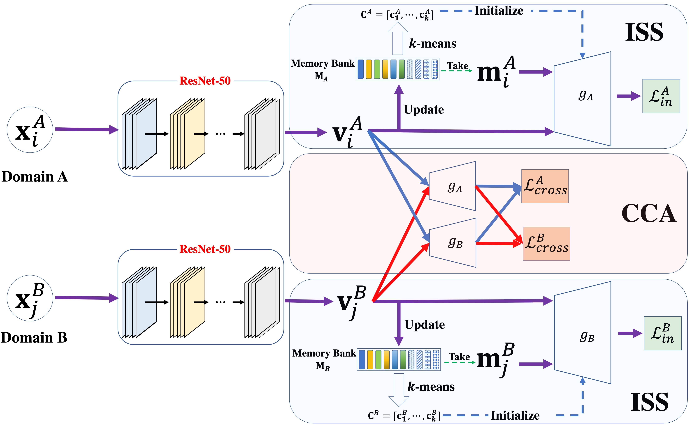

# CoDA
PyTorch implementation for [Correspondence-Free Domain Alignment for Unsupervised Cross-Domain Image Retrieval](https://arxiv.org/pdf/2302.06081.pdf) (AAAI 2023).
## Introduction

### CoDA framework



## Datasets

The directory structure of ```datasets```.
```
datasets
├── OfficeHomeDataset_10072016 # 
│     ├── Art
│     ├── Clipart
│     ├── Product
│     ├── Real_World
│     ├── ......
```


## Training and Evaluation
```
cd shells
sh run_coda.sh
```


## Citation
If CoDA is useful for your research, please consider citing the paper:
```
@inproceedings{Wang2023CoDA,
    author = {Wang, Xu and Peng, Dezhong and Yan, Ming and Hu, Peng},
    title = {Correspondence-Free Domain Alignment for Unsupervised Cross-Domain Image Retrieval},
    year = {2022},
    booktitle = {The Thirty-Seventh AAAI Conference on Artificial Intelligence},
    series = {AAAI 2023}
}
```

## License

[Apache License 2.0](http://www.apache.org/licenses/LICENSE-2.0)
